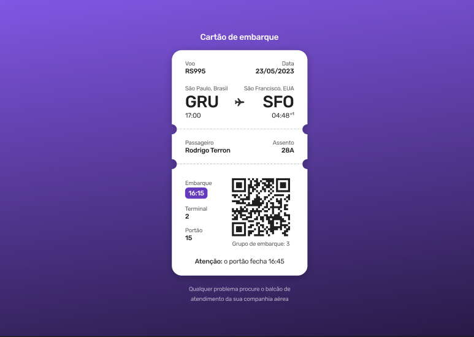

<h1 align="center">
  
  #boraCodar 06 - Boarding Pass
</h1>

<p align="center">🌐🚀 Resoluções do desafios 06, um projeto de cartão de embarque.</p>

<p align="center">
  <a href="#-tecnologias">Tecnologias</a>&nbsp;&nbsp;&nbsp;|&nbsp;&nbsp;&nbsp;
  <a href="#-ferramentas">Ferramentas</a>&nbsp;&nbsp;&nbsp;|&nbsp;&nbsp;&nbsp;
  <a href="#-execução">Execução</a>&nbsp;&nbsp;&nbsp;|&nbsp;&nbsp;&nbsp;
  <a href="#-layout">Layout</a>&nbsp;&nbsp;&nbsp;|&nbsp;&nbsp;&nbsp;
  <a href="#-autor">Autor</a>&nbsp;&nbsp;&nbsp;|&nbsp;&nbsp;&nbsp;
</p>

<div align="center">



</div>

<p align="center">
  <a href="#" target="_blank">
    
  </a>
  <a href="https://twitter.com/Wesley_AllanS" target="_blank">
    
  </a>
</p>

## [✨ Deploy](https://boardingpass-wesleyallan.netlify.app/)

## 🚀 Tecnologias

Tecnologias utilizadas no desenvolvimento no código do projeto.

- React
- JSX
- CSS Modules

## 🔧 Ferramentas

Ferramentas utilizadas para o desenvolvimento e manutenção do código do projeto.

- Visual Studio Code
- Vite
- Git
- Prettier
- Editor Config
- Figma

## ⚙ Execução

Para instalar e executar o projeto é necessário as seguintes dependências.

- Gerenciador de Pacotes (NPM, Yarn, etc...)
- Git

```sh
# Instalação
git clone https://github.com/wesleyallan/boarding-pass.git
cd boarding-pass
yarn install

# Execução
yarn dev
```

## 📑 Layout

Você pode acessar o layout do projeto do cartão de embarque através do [Figma](https://www.figma.com/community/file/1205146101173113980) da Rocketseat.

## 👤 Autor

**Wesley Silva**

- Website: [wesleyallan.dev](https://wesleyallan.dev)
- Twitter: [@Wesley_AllanS](https://twitter.com/Wesley_AllanS)
- Github: [@wesleyallan](https://github.com/wesleyallan)
- LinkedIn: [@wesleyallan](https://linkedin.com/in/wesleyallan)

## Mostre seu apoio

Dê um ⭐️ se esse projeto te ajudou!
